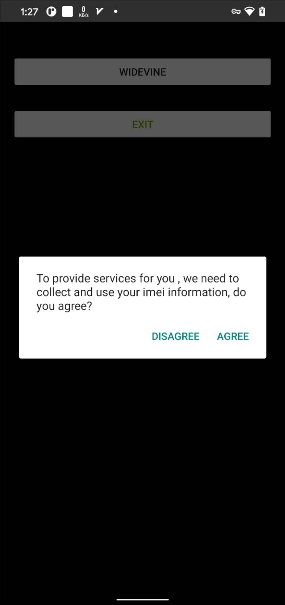
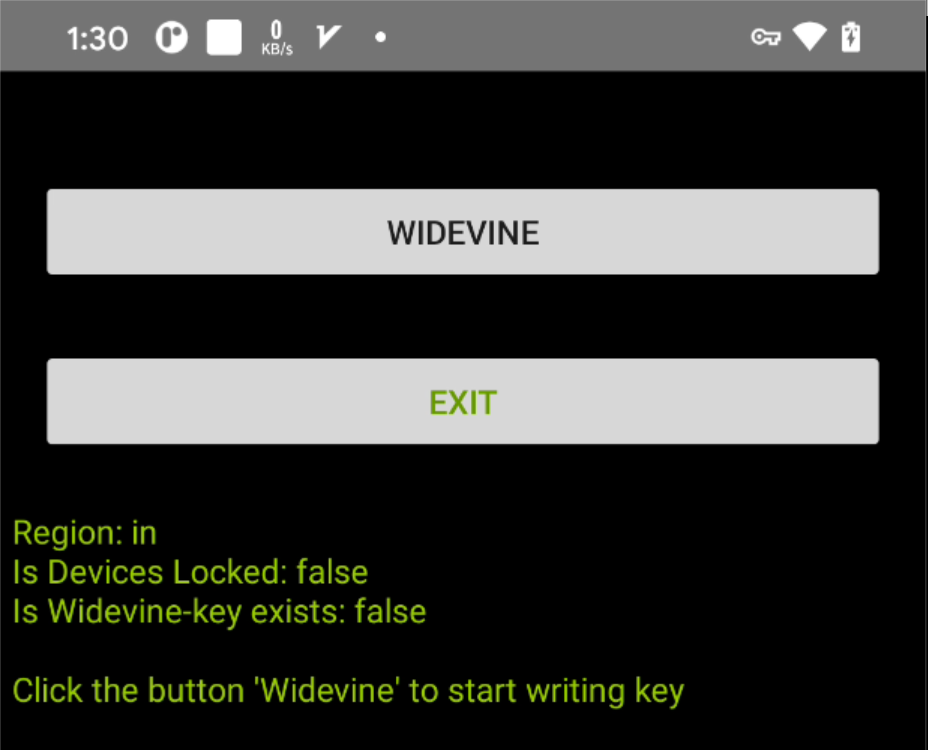
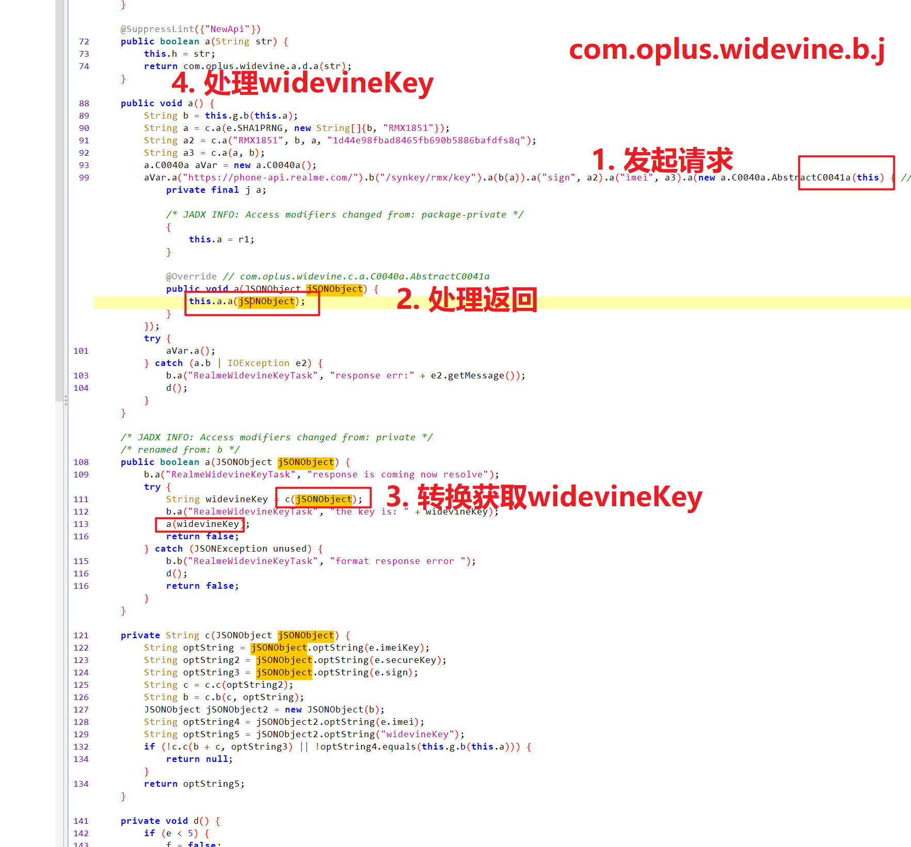
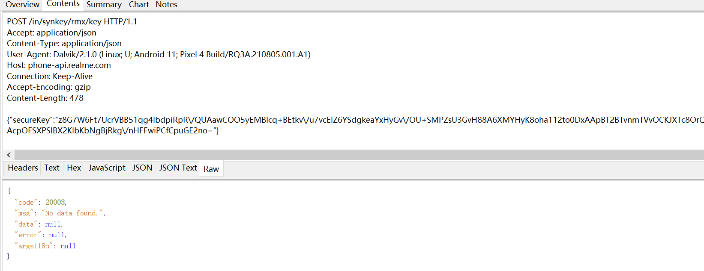
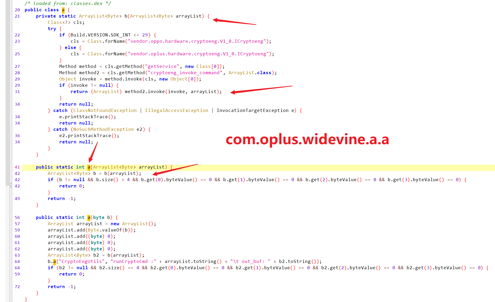
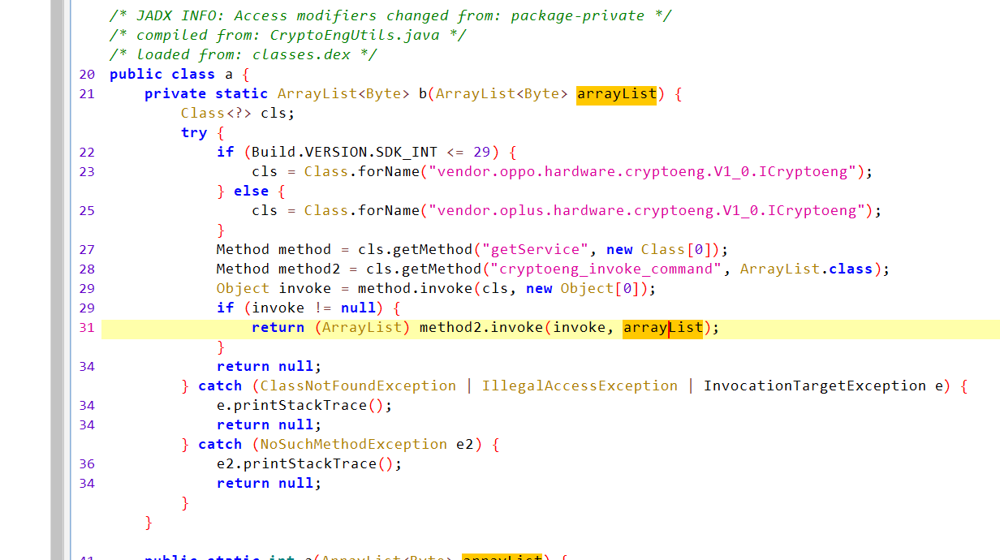
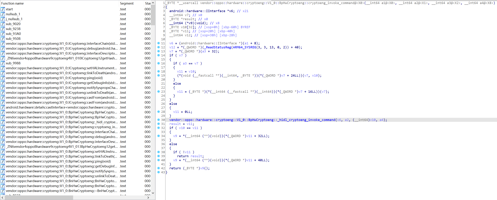

这是一个OPPO用于给海外版Realme没有L1的设备写入keybox的APP，简单分析如下

# 分析

入口是`com.oplus.widevine.MainActivity`

如果直接点击打开可能会提示`APP isn't installed`，可以用am命令启动

```bash
am start -n com.oplus.widevine/com.oplus.widevine.MainActivity
```

主界面如图



点击`AGREE`



看下它的logcat，然后点击`WIDEVINE`

```java
12-26 13:33:38.178 25289 25289 E .oplus.widevin: Not starting debugger since process cannot load the jdwp agent.
12-26 13:33:38.204 25289 25289 D NetworkSecurityConfig: No Network Security Config specified, using platform default
12-26 13:33:38.204 25289 25289 D NetworkSecurityConfig: No Network Security Config specified, using platform default
12-26 13:33:38.253 25289 25309 I AdrenoGLES-0: QUALCOMM build                   : 85da404, I46ff5fc46f
12-26 13:33:38.253 25289 25309 I AdrenoGLES-0: Build Date                       : 11/30/20
12-26 13:33:38.253 25289 25309 I AdrenoGLES-0: OpenGL ES Shader Compiler Version: EV031.31.04.01
12-26 13:33:38.253 25289 25309 I AdrenoGLES-0: Local Branch                     : promo490_3_Google
12-26 13:33:38.253 25289 25309 I AdrenoGLES-0: Remote Branch                    :
12-26 13:33:38.253 25289 25309 I AdrenoGLES-0: Remote Branch                    :
12-26 13:33:38.253 25289 25309 I AdrenoGLES-0: Reconstruct Branch               :
12-26 13:33:38.253 25289 25309 I AdrenoGLES-0: Build Config                     : S P 10.0.4 AArch64
12-26 13:33:38.253 25289 25309 I AdrenoGLES-0: Driver Path                      : /vendor/lib64/egl/libGLESv2_adreno.so
12-26 13:33:38.256 25289 25309 I AdrenoGLES-0: PFP: 0x016ee189, ME: 0x00000000
12-26 13:33:38.259 25289 25309 W AdrenoUtils: <ReadGpuID_from_sysfs:197>: Failed to open /sys/class/kgsl/kgsl-3d0/gpu_model
12-26 13:33:38.259 25289 25309 W AdrenoUtils: <ReadGpuID:221>: Failed to read chip ID from gpu_model. Fallback to use the GSL path
12-26 13:33:38.265 25289 25309 I Gralloc4: mapper 4.x is not supported
12-26 13:33:40.074 25289 25289 W Choreographer: Frame time is 0.283721 ms in the future!  Check that graphics HAL is generating vsync timestamps using the correct timebase.

12-26 13:34:00.784 25289 25309 D OpenGLRenderer: endAllActiveAnimators on 0xb4000070bacf6e50 (RippleDrawable) with handle 0xb400006fdad21aa0
12-26 13:34:00.795 25289 25289 I TetheringManager: registerTetheringEventCallback:com.oplus.widevine
12-26 13:34:00.796 25289 25289 W System.err: java.lang.ClassNotFoundException: vendor.oplus.hardware.cryptoeng.V1_0.ICryptoeng
12-26 13:34:00.796 25289 25289 W System.err:    at java.lang.Class.classForName(Native Method)
12-26 13:34:00.796 25289 25289 W System.err:    at java.lang.Class.forName(Class.java:454)
12-26 13:34:00.796 25289 25289 W System.err:    at java.lang.Class.forName(Class.java:379)
12-26 13:34:00.796 25289 25289 W System.err:    at com.oplus.widevine.a.a.b(CryptoEngUtils.java:25)
12-26 13:34:00.796 25289 25289 W System.err:    at com.oplus.widevine.a.a.a(CryptoEngUtils.java:42)
12-26 13:34:00.796 25289 25289 W System.err:    at com.oplus.widevine.a.d.a(RealmeKeysBoxUtils.java:40)
12-26 13:34:00.796 25289 25289 W System.err:    at com.oplus.widevine.MainActivity.a(MainActivity.java:100)
12-26 13:34:00.796 25289 25289 W System.err:    at com.oplus.widevine.MainActivity.b(MainActivity.java:50)
12-26 13:34:00.796 25289 25289 W System.err:    at com.oplus.widevine.c.onClick(Unknown Source:2)
12-26 13:34:00.796 25289 25289 W System.err:    at androidx.appcompat.app.AlertController$b.handleMessage(AlertController.java:167)
12-26 13:34:00.796 25289 25289 W System.err:    at android.os.Handler.dispatchMessage(Handler.java:106)
12-26 13:34:00.796 25289 25289 W System.err:    at android.os.Looper.loop(Looper.java:223)
12-26 13:34:00.797 25289 25289 W System.err:    at android.app.ActivityThread.main(ActivityThread.java:7664)
12-26 13:34:00.797 25289 25289 W System.err:    at java.lang.reflect.Method.invoke(Native Method)
12-26 13:34:00.797 25289 25289 W System.err:    at com.android.internal.os.RuntimeInit$MethodAndArgsCaller.run(RuntimeInit.java:592)
12-26 13:34:00.797 25289 25289 W System.err:    at com.android.internal.os.ZygoteInit.main(ZygoteInit.java:947)
12-26 13:34:00.797 25289 25289 W System.err: Caused by: java.lang.ClassNotFoundException: vendor.oplus.hardware.cryptoeng.V1_0.ICryptoeng
12-26 13:34:00.797 25289 25289 W System.err:    ... 16 more

12-26 13:34:05.738 25289 25289 W System.err: java.lang.ClassNotFoundException: vendor.oplus.hardware.cryptoeng.V1_0.ICryptoeng
12-26 13:34:05.738 25289 25289 W System.err:    at java.lang.Class.classForName(Native Method)
12-26 13:34:05.738 25289 25289 W System.err:    at java.lang.Class.forName(Class.java:454)
12-26 13:34:05.738 25289 25289 W System.err:    at java.lang.Class.forName(Class.java:379)
12-26 13:34:05.738 25289 25289 W System.err:    at com.oplus.widevine.a.a.b(CryptoEngUtils.java:25)
12-26 13:34:05.738 25289 25289 W System.err:    at com.oplus.widevine.a.a.a(CryptoEngUtils.java:42)
12-26 13:34:05.738 25289 25289 W System.err:    at com.oplus.widevine.a.d.a(RealmeKeysBoxUtils.java:40)
12-26 13:34:05.738 25289 25289 W System.err:    at com.oplus.widevine.b.j.c(RealmeWidevineKeyTask.java:160)
12-26 13:34:05.738 25289 25289 W System.err:    at com.oplus.widevine.b.g.a(RealmeKeysManager.java:55)
12-26 13:34:05.739 25289 25289 W System.err:    at com.oplus.widevine.MainActivity.b(MainActivity.java:66)
12-26 13:34:05.739 25289 25289 W System.err:    at com.oplus.widevine.MainActivity.b(MainActivity.java:38)
12-26 13:34:05.739 25289 25289 W System.err:    at com.oplus.widevine.a.onClick(Unknown Source:2)
12-26 13:34:05.739 25289 25289 W System.err:    at android.view.View.performClick(View.java:7448)
12-26 13:34:05.739 25289 25289 W System.err:    at android.view.View.performClickInternal(View.java:7425)
12-26 13:34:05.739 25289 25289 W System.err:    at android.view.View.access$3600(View.java:810)
12-26 13:34:05.739 25289 25289 W System.err:    at android.view.View$PerformClick.run(View.java:28305)
12-26 13:34:05.739 25289 25289 W System.err:    at android.os.Handler.handleCallback(Handler.java:938)
12-26 13:34:05.739 25289 25289 W System.err:    at android.os.Handler.dispatchMessage(Handler.java:99)
12-26 13:34:05.739 25289 25289 W System.err:    at android.os.Looper.loop(Looper.java:223)
12-26 13:34:05.739 25289 25289 W System.err:    at android.app.ActivityThread.main(ActivityThread.java:7664)
12-26 13:34:05.739 25289 25289 W System.err:    at java.lang.reflect.Method.invoke(Native Method)
12-26 13:34:05.739 25289 25289 W System.err:    at com.android.internal.os.RuntimeInit$MethodAndArgsCaller.run(RuntimeInit.java:592)
12-26 13:34:05.739 25289 25289 W System.err:    at com.android.internal.os.ZygoteInit.main(ZygoteInit.java:947)
12-26 13:34:05.739 25289 25289 W System.err: Caused by: java.lang.ClassNotFoundException: vendor.oplus.hardware.cryptoeng.V1_0.ICryptoeng
12-26 13:34:05.739 25289 25289 W System.err:    ... 22 more
--------- beginning of crash
12-26 13:34:05.744 25289 25354 E AndroidRuntime: FATAL EXCEPTION: oplus_keys_service
12-26 13:34:05.744 25289 25354 E AndroidRuntime: Process: com.oplus.widevine, PID: 25289
12-26 13:34:05.744 25289 25354 E AndroidRuntime: java.lang.SecurityException: getImeiForSlot: The user 10286 does not meet the requirements to access device identifiers.
12-26 13:34:05.744 25289 25354 E AndroidRuntime:        at android.os.Parcel.createExceptionOrNull(Parcel.java:2373)
12-26 13:34:05.744 25289 25354 E AndroidRuntime:        at android.os.Parcel.createException(Parcel.java:2357)
12-26 13:34:05.744 25289 25354 E AndroidRuntime:        at android.os.Parcel.readException(Parcel.java:2340)
12-26 13:34:05.744 25289 25354 E AndroidRuntime:        at android.os.Parcel.readException(Parcel.java:2282)
12-26 13:34:05.744 25289 25354 E AndroidRuntime:        at com.android.internal.telephony.ITelephony$Stub$Proxy.getImeiForSlot(ITelephony.java:11517)
12-26 13:34:05.744 25289 25354 E AndroidRuntime:        at android.telephony.TelephonyManager.getImei(TelephonyManager.java:2059)
12-26 13:34:05.744 25289 25354 E AndroidRuntime:        at com.oplus.widevine.c.d.b(Utils.java:87)
12-26 13:34:05.744 25289 25354 E AndroidRuntime:        at com.oplus.widevine.b.j.a(RealmeWidevineKeyTask.java:89)
12-26 13:34:05.744 25289 25354 E AndroidRuntime:        at com.oplus.widevine.b.j.handleMessage(RealmeWidevineKeyTask.java:52)
12-26 13:34:05.744 25289 25354 E AndroidRuntime:        at android.os.Handler.dispatchMessage(Handler.java:106)
12-26 13:34:05.744 25289 25354 E AndroidRuntime:        at android.os.Looper.loop(Looper.java:223)
12-26 13:34:05.744 25289 25354 E AndroidRuntime:        at android.os.HandlerThread.run(HandlerThread.java:67)
12-26 13:34:05.744 25289 25289 W System.err: java.lang.ClassNotFoundException: vendor.oplus.hardware.cryptoeng.V1_0.ICryptoeng
12-26 13:34:05.744 25289 25289 W System.err:    at java.lang.Class.classForName(Native Method)
12-26 13:34:05.744 25289 25289 W System.err:    at java.lang.Class.forName(Class.java:454)
12-26 13:34:05.744 25289 25289 W System.err:    at java.lang.Class.forName(Class.java:379)
12-26 13:34:05.744 25289 25289 W System.err:    at com.oplus.widevine.a.a.b(CryptoEngUtils.java:25)
12-26 13:34:05.744 25289 25289 W System.err:    at com.oplus.widevine.a.a.a(CryptoEngUtils.java:42)
12-26 13:34:05.744 25289 25289 W System.err:    at com.oplus.widevine.a.d.a(RealmeKeysBoxUtils.java:40)
12-26 13:34:05.744 25289 25289 W System.err:    at com.oplus.widevine.MainActivity$a.onTick(MainActivity.java:175)
12-26 13:34:05.744 25289 25289 W System.err:    at android.os.CountDownTimer$1.handleMessage(CountDownTimer.java:130)
12-26 13:34:05.744 25289 25289 W System.err:    at android.os.Handler.dispatchMessage(Handler.java:106)
12-26 13:34:05.744 25289 25289 W System.err:    at android.os.Looper.loop(Looper.java:223)
12-26 13:34:05.744 25289 25289 W System.err:    at android.app.ActivityThread.main(ActivityThread.java:7664)
12-26 13:34:05.744 25289 25289 W System.err:    at java.lang.reflect.Method.invoke(Native Method)
12-26 13:34:05.744 25289 25289 W System.err:    at com.android.internal.os.RuntimeInit$MethodAndArgsCaller.run(RuntimeInit.java:592)
12-26 13:34:05.745 25289 25289 W System.err:    at com.android.internal.os.ZygoteInit.main(ZygoteInit.java:947)
12-26 13:34:05.745 25289 25289 W System.err: Caused by: java.lang.ClassNotFoundException: vendor.oplus.hardware.cryptoeng.V1_0.ICryptoeng
12-26 13:34:05.745 25289 25289 W System.err:    ... 14 more
12-26 13:34:05.810 25289 25354 I Process : Sending signal. PID: 25289 SIG: 9
```

可以看到它缺少`oplus_keys_service`

然后另一个是`com.oplus.widevine.c.d.b`方法异常

```java
@SuppressLint({"MissingPermission", "NewApi"})
public String b(Context context) {
    return ((TelephonyManager) context.getSystemService("phone")).getImei(0);
}
```

这里就是获取IMEI异常了，在Android 10之后必须有`READ_PRIVILEGED_PHONE_STATE`，不过根据官方的说明，看起来是系统预装的才有这个权限

- https://source.android.google.cn/devices/tech/config/perms-whitelist?hl=zh-cn

那么这里手动改成固定值

- 352931104259429


```java
(agent) [4010867386527] Called com.oplus.widevine.b.i.b(java.lang.String)
(agent) [4010867386527] Backtrace:
        com.oplus.widevine.b.i.b(Native Method)
        com.oplus.widevine.b.j.a(RealmeWidevineKeyTask.java:96)
        com.oplus.widevine.b.j.handleMessage(RealmeWidevineKeyTask.java:52)
        android.os.Handler.dispatchMessage(Handler.java:106)
        android.os.Looper.loop(Looper.java:223)
        android.os.HandlerThread.run(HandlerThread.java:67)

(agent) [4010867386527] Arguments com.oplus.widevine.b.i.b("DA77F39792401A8636B7E99FABDF97B2")
(agent) [4010867386527] Return Value: "<instance: android.content.ContentValues>"
(agent) [4010867386527] Called com.oplus.widevine.b.i.b(java.lang.String)
(agent) [4010867386527] Backtrace:
        com.oplus.widevine.b.i.b(Native Method)
        com.oplus.widevine.b.j.a(RealmeWidevineKeyTask.java:96)
        com.oplus.widevine.b.j.handleMessage(RealmeWidevineKeyTask.java:52)
        android.os.Handler.dispatchMessage(Handler.java:106)
        android.os.Looper.loop(Looper.java:223)
        android.os.HandlerThread.run(HandlerThread.java:67)

(agent) [4010867386527] Arguments com.oplus.widevine.b.i.b("097D347E1306C12BAFE47669A8E85BF5")
(agent) [4010867386527] Return Value: "<instance: android.content.ContentValues>"
```

请求处理



测试返回如下



转byte然后转对应的数组


然后调用`com.oplus.widevine.a.a`，如果调用成功，那么返回`key is write succes`



最终获取`cryptoeng`相关系统服务

然后调用`vendor::oppo::hardware::cryptoeng::V1_0::BpHwCryptoeng::cryptoeng_invoke_command`

- com.oplus.widevine.a.a.b



参数等于就是返回的`widevineKey`的byte数组

简单看这个so，似乎没有涉及一些特别处理（看不太懂），也不知道具体会怎么处理



# 总结

看反编译结果，还有一些其他的请求，结合网上的帖子，似乎流程是这样的

- 先找客服，告诉设备的IMEI
- 后台服务器处理
- 过一天还是两天后再使用这个APP操作
- 这个APP需要设备有相关的服务才行
- 推测服务作用是转换命令，调用谷歌官方的方法向设备写入keybox

也就是说这里的keybox还是加密的，没法解密...