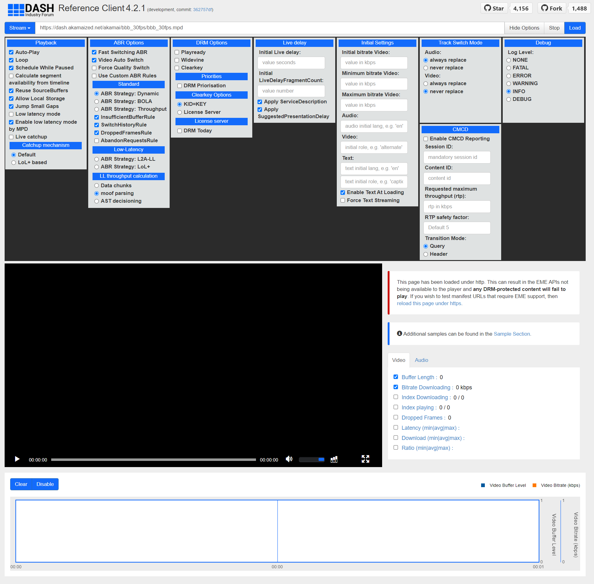
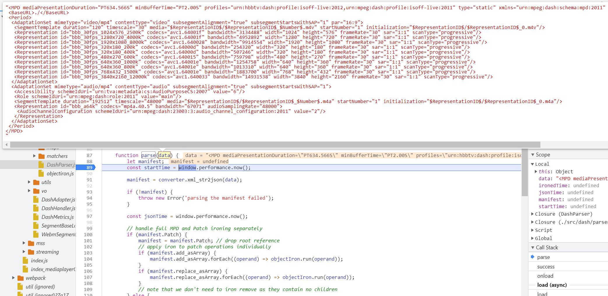
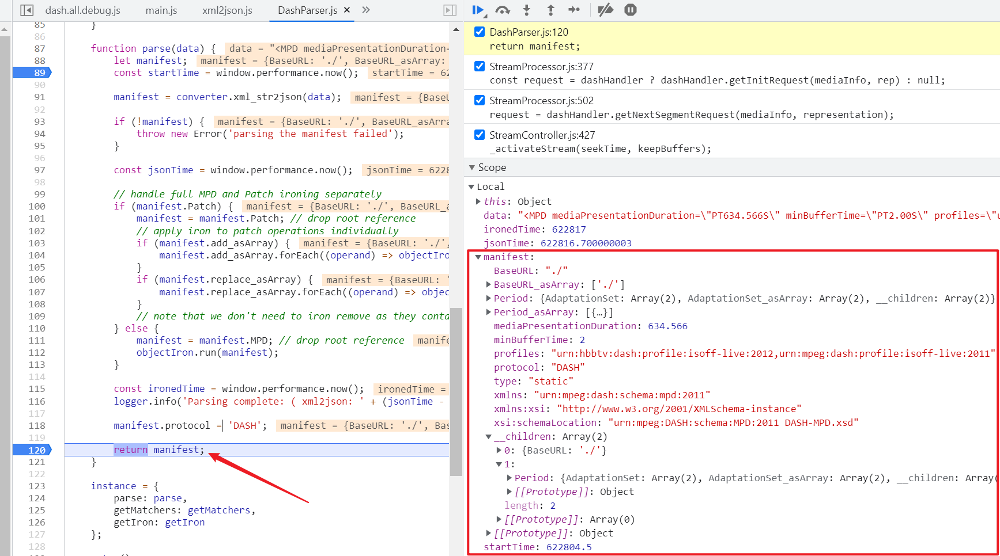
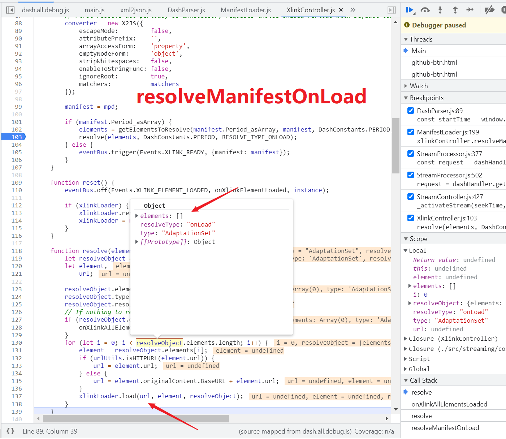
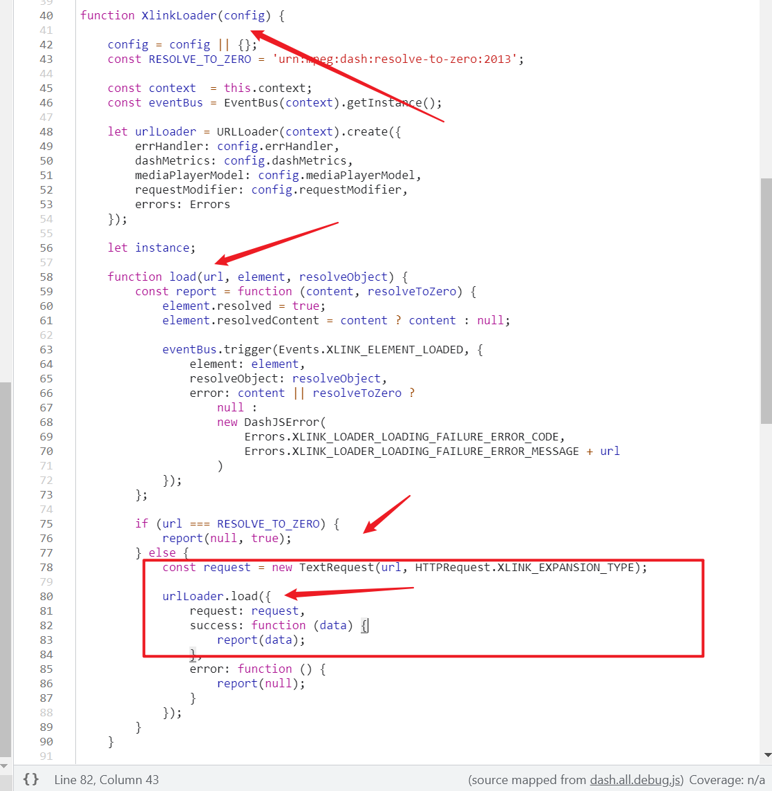
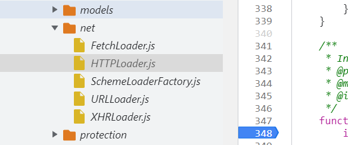
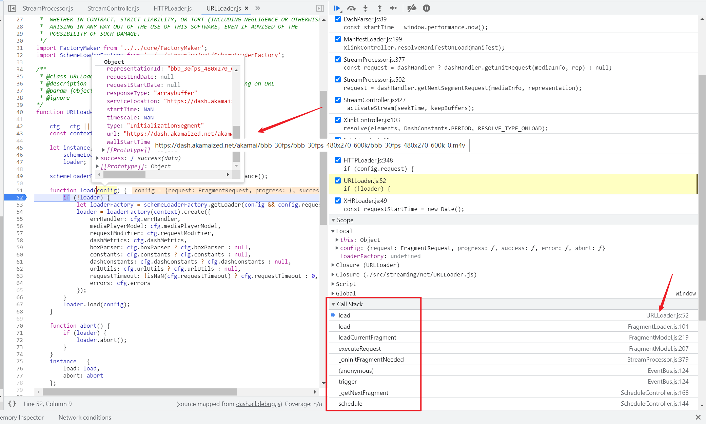
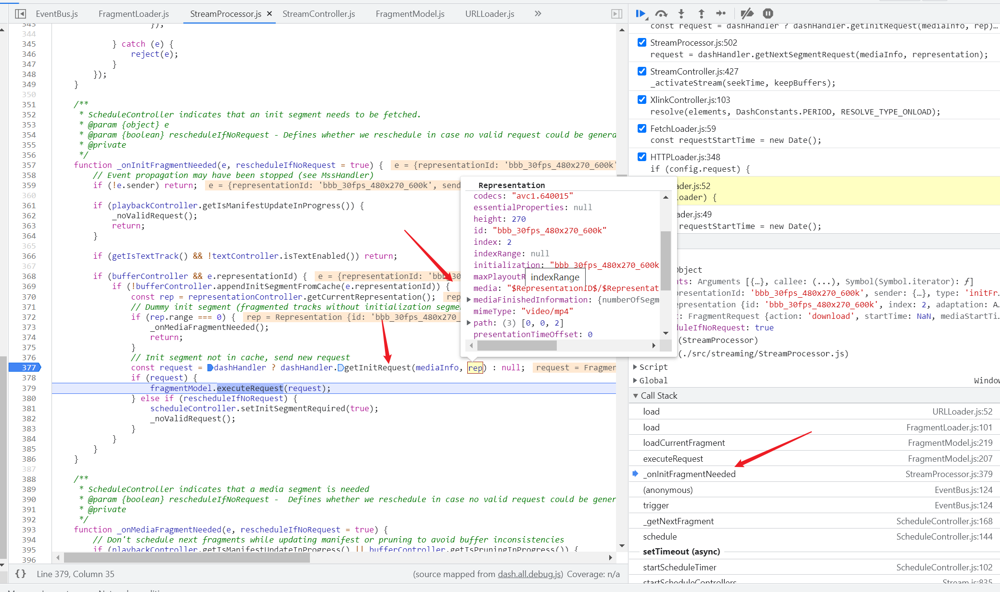
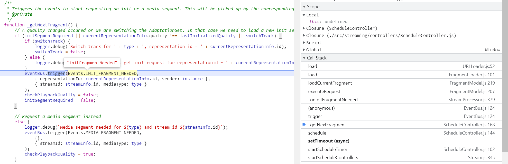
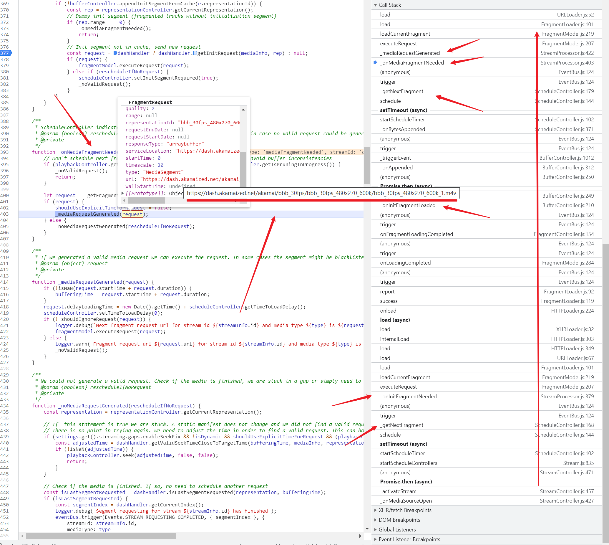

**提取dashif的解析实现，优化XstreamDL-CLI，没成**

# 前言

- https://github.com/Dash-Industry-Forum/dash.js

`dash.js`是一个作为参考的基于JavaScript并支持浏览器播放MPEG DASH的客户端

本文目标是提取核心解析模块，得到解析mpd的最佳程序，因为ISO内容实在是太多了，个人手动实现肯定无法考虑全面

虽然我自己尝试实现了一个，但是并不完善，时不时就需要修一下...(于是尝试直接copy...

# 分析

这个js是部署了在线版本的，工程本身比较复杂，由于我关心的是解析过程，于是直接在这个网页上调试就行

- http://reference.dashif.org/dash.js/nightly/samples/dash-if-reference-player/index.html

网页预览如下，可以看到功能还是相当丰富的



既然关注解析功能，那么首先找找官方的测试用例

- https://github.com/Dash-Industry-Forum/dash.js/blob/development/test/unit/dash.DashParser.js

测试用例中调用了`DashParser`的`parse`方法

- https://github.com/Dash-Industry-Forum/dash.js/blob/362757dff223116c020fb43d7e5b362035477a5e/test/unit/dash.DashParser.js#L32

那么找到这个位置下断点，然后点击页面上的Load按钮加载mpd



对这部分代码理解如下

- `converter.xml_str2json` => 将mpd内容解析，xml转json
- `manifest.Patch`为真则执行`objectIron.run(operand)`这样的操作
- `manifest.Patch`不为真则执行`objectIron.run(manifest)`

至于`manifest.Patch`和`objectIron.run`干了什么，并不关心

```javascript
function parse(data) {
    let manifest;
    const startTime = window.performance.now();
    manifest = converter.xml_str2json(data);
    if (!manifest) {
        throw new Error('parsing the manifest failed');
    }
    const jsonTime = window.performance.now();
    // handle full MPD and Patch ironing separately
    if (manifest.Patch) {
        manifest = manifest.Patch; // drop root reference
        // apply iron to patch operations individually
        if (manifest.add_asArray) {
            manifest.add_asArray.forEach((operand) => objectIron.run(operand));
        }
        if (manifest.replace_asArray) {
            manifest.replace_asArray.forEach((operand) => objectIron.run(operand));
        }
        // note that we don't need to iron remove as they contain no children
    } else {
        manifest = manifest.MPD; // drop root reference
        objectIron.run(manifest);
    }
    const ironedTime = window.performance.now();
    logger.info('Parsing complete: ( xml2json: ' + (jsonTime - startTime).toPrecision(3) + 'ms, objectiron: ' + (ironedTime - jsonTime).toPrecision(3) + 'ms, total: ' + ((ironedTime - startTime) / 1000).toPrecision(3) + 's)');
    manifest.protocol = 'DASH';
    return manifest;
}
```

调试直接到`parse`返回处，可以发现目前并没有出现链接什么的，也就是说到这里只是将mpd转换成后续方便处理的结构了



这种处理逻辑很容易理解，在`XstreamDL_CLI`下不同类型元数据也都有一个`handler.py`做预处理

返回上一级，可以发现处理逻辑位于

- https://github.com/Dash-Industry-Forum/dash.js/blob/ef00170de31828ce0ace7c392c69fb3791d697f6/src/streaming/ManifestLoader.js#L170

`parse`结束后，正常情况下会执行下面的处理，主要是

- 预处理`Location`
- `resolveManifestOnLoad`处理各个节点，类似于`XstreamDL_CLI`中的`walk_xxx`函数
- 触发`Events.ORIGINAL_MANIFEST_LOADED`事件

```javascript
manifest.url = actualUrl || url;
// URL from which the MPD was originally retrieved (MPD updates will not change this value)
if (!manifest.originalUrl) {
    manifest.originalUrl = manifest.url;
}
// In the following, we only use the first Location entry even if many are available
// Compare with ManifestUpdater/DashManifestModel
if (manifest.hasOwnProperty(Constants.LOCATION)) {
    baseUri = urlUtils.parseBaseUrl(manifest.Location_asArray[0]);
    logger.debug('BaseURI set by Location to: ' + baseUri);
}
manifest.baseUri = baseUri;
manifest.loadedTime = new Date();
xlinkController.resolveManifestOnLoad(manifest);
eventBus.trigger(Events.ORIGINAL_MANIFEST_LOADED, { originalManifest: data });
```

到这里`ManifestLoader.js`的`load`函数就结束了

跟进`resolveManifestOnLoad`，再到`resolve`



可以发现即使`resolve`结束也并没有执行`xlinkLoader.load`，也就是说到这里还没有拼接出链接

不过进入`xlinkLoader.load`另有发现，从命名上看，推测这里应该是请求的一个文本类链接，不过这不重要

重要的是最后走的是`urlLoader.load`，那么合理推测其他链接应该都会用这个



然后发现引用自`streaming`的`net`模块



那么把它们的load函数都下断点，`SchemeLoaderFactory.js`没有`load`函数，不管它

- FetchLoader.js
- HTTPLoader.js
- URLLoader.js
- XHRLoader.js

现在可以看到第一个链接请求的调用过程，如此便可以往前查看推导这个链接是如何生成的



`StreamProcessor.js`的`_onInitFragmentNeeded`



`ScheduleController.js`的`_getNextFragment`



可以看到链接生成是`_onInitFragmentNeeded`的`dashHandler.getInitRequest`

按这个过程调试，然后下一个分段的调用情况是这样的



关键位置是`StreamProcessor.js`的`_onMediaFragmentNeeded`

可以发现它们都来自于`ScheduleController.js`的`_getNextFragment`

- Events.INIT_FRAGMENT_NEEDED
- Events.MEDIA_FRAGMENT_NEEDED

```JavaScript
/**
    * Triggers the events to start requesting an init or a media segment. This will be picked up by the corresponding StreamProcessor.
    * @private
    */
function _getNextFragment() {
    // A quality changed occured or we are switching the AdaptationSet. In that case we need to load a new init segment
    if (initSegmentRequired || currentRepresentationInfo.quality !== lastInitializedQuality || switchTrack) {
        if (switchTrack) {
            logger.debug('Switch track for ' + type + ', representation id = ' + currentRepresentationInfo.id);
            switchTrack = false;
        } else {
            logger.debug('Quality has changed, get init request for representationid = ' + currentRepresentationInfo.id);
        }
        eventBus.trigger(Events.INIT_FRAGMENT_NEEDED,
            { representationId: currentRepresentationInfo.id, sender: instance },
            { streamId: streamInfo.id, mediaType: type }
        );
        checkPlaybackQuality = false;
        initSegmentRequired = false;
    }
    // Request a media segment instead
    else {
        logger.debug(`Media segment needed for ${type} and stream id ${streamInfo.id}`);
        eventBus.trigger(Events.MEDIA_FRAGMENT_NEEDED,
            {},
            { streamId: streamInfo.id, mediaType: type }
        );
        checkPlaybackQuality = true;
    }

}
```

调用过程看起来比较长，不过这也不是很重要，我只关心链接何处生成

检查`_onMediaFragmentNeeded`，可以知道链接生成是`dashHandler.getNextSegmentRequest`

至此找到了mpd到分段链接的关键处理函数

- **DashParser.js** `parse`
- **DashHandler.js** `getInitRequest`
- **DashHandler.js** `getNextSegmentRequest`

# 简化

现在的目标就是将上面的几个关键函数和必要处理过程拿出来

借鉴一下

- https://github.com/Dash-Industry-Forum/dash.js/blob/development/test/unit/dash.DashParser.js

导入必须带后缀，vscode正则替换，不然得用webpack

- `import (.+?) from (.+?)';`
- `import $1 from $2.js';`

包含文件`dashjs/src/*`

`moudle`导入没有`require`，改写导入为下面的形式

```JavaScript
import * as fs from 'fs';
import {JSDOM as jsdom} from 'jsdom';
```

`describe`是`mocha`库，`chai`也是测试用的，这里不需要，删除相关部分

那么这里需要的库是`jsdom`

那么解析第一步的代码如下

```JavaScript
import DashParser from './src/dash/parser/DashParser.js';
import DebugMock from './DebugMock.js';

import * as fs from 'fs';
import {JSDOM as jsdom} from 'jsdom';

const context = {};

let dashParser = DashParser(context).create({debug: new DebugMock()});

if (typeof window === 'undefined') {
    global.window = {
        performance: {
            now: function () {
                return Date.now();
            }
        },
        DOMParser:  new jsdom().window.DOMParser
    };
}

let __dirname = process.cwd();
let manifest = fs.readFileSync(__dirname + '/samples/dash/bbb_30fps.mpd', 'utf8');
dashParser.parse(manifest);
```

...

---

后面生成链接是，这两个里面主要就是根据mediaInfo内容格式化拼接

- dashHandler.getInitRequest
- dashHandler._getFragmentRequest

所以重点还是`mediaInfo`怎么来的，比较关键的地方在

- src/dash/DashAdapter.js

不过挺多的...不想分析了，XstreamDL-CLI多加几个if又不是不能用是吧...