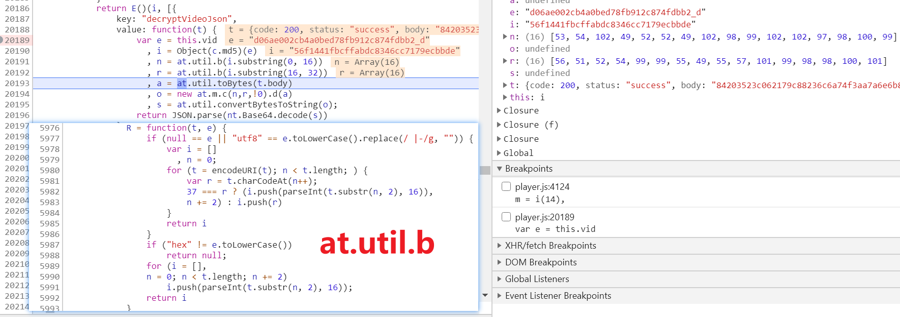

# JavaScript简单语法和polyv视频接口信息解密

- 主要内容

    - JavaScript简单语法，变量、函数
    - 基于Chrome Overrides功能映射js到本地文件，辅助分析js
    - 基于Chrome Initiator功能快速定位加密内容解密算法
    - 翻译js代码为python代码
    - 完成接口内容解密

目标地址 https://www.exueshi.com/play/p201903981228671dd33a_5

<!-- more -->

# 过程

## JavaScript简单语法

- 字符串、数组、对象
- 关键字、函数

其他知识点

- this
    - 可以认为this所在作用域本身（个人理解）

- 如何避免转义？
    - 使用`String.raw`，字符串用反引号引起来，TAB上面那个键（英文输入法下）

```javascript
var rawstring = String.raw`这里是字符串`;
```

- 三元运算符
    - 满足条件则运算冒号前的代码，否则运算冒号后的代码

```javascript
condition ? expr1 : expr2
```

- 逻辑运算和位移运算
    - 逻辑运算符 -> `&& || !`
    - 下面第一句话的理解：如果a大于6，那么再计算`n % a == 4`，如果这个条件成立，再执行`l = h`
    - 位移运算符 -> `>> << >>>`
    - 下面第二句话的理解：先计算`l << 8 | l >>> 24`，然后将结果赋给`l`，`l`再循环右移24位

```javascript
a > 6 && n % a == 4 && (l = h)
```

```javascript
(l = l << 8 | l >>> 24) >>> 24
```

- for循环 `for(A;B;C){}`
    - 先执行A部分的代码，在满足B部分的条件下，开始循环
    - 每一轮循环结束执行C部分的代码，如果满足B部分的代码，继续循环

**一定要注意运算符的优先级**

相关链接：

- https://developer.mozilla.org/zh-CN/docs/Web/JavaScript/Reference/Operators/Logical_Operators
- https://developer.mozilla.org/zh-CN/docs/Web/JavaScript/Reference/Operators/Bitwise_Operators
- https://developer.mozilla.org/zh-CN/docs/Web/JavaScript/Reference/Operators/Operator_Precedence

## 基于Chrome Overrides功能映射本地文件

首先新建一个文件夹，我这里就是本教程的文件夹

然后在文件夹下新建一个名字为`要替换的内容对应链接的域名`的文件夹

最后按照链接路径新建文件夹和文件

例如

- `https://player.polyv.net/script/polyvplayer.min.js`

- 对应的结构如下

```bash
\---player.polyv.net
    \---script
            polyvplayer.min.js
```

对应js的内容，我们可以在`Network`找到对应的链接下载，或者直接复制粘贴格式化后的内容

用格式化后主要是方面查看、分析和下断点

这里建议直接复制`Preview`中的内容

如果文件太大，可以将文件下载后/Response中复制，在`Sources`的`Snippets`中新建一个临时脚本进行格式化


完成文件（夹）的新建后，将根文件夹（也就是各个域名文件夹所在文件夹）添加到映射


## 基于Chrome Initiator功能快速定位加密内容解密算法

在将js映射到本地文件后，我们在js最开始加上两句日志输出


打开在线地址，打开`Console`，然后发现`player.js`没有输出我们期望的日志


观察它的地址（↓）可以发现后面是一个变化的时间戳

- `https://player.polyv.net/script/player.js?_=1612149481625`

而本地的文件名是没有这个的，就算改了文件名，你也不知道下一次时间戳是多少

为了方便分析，那必须得定向到本地的js

`Initiator`翻译是启动器，我认为可以直接理解为这个产生这个请求的`调用链`

而如果一个请求是另外一个js产生的，那么`Initiator`还会有`Request call stack`，也就是`请求调用栈`

那么我们可以查看`player.js`请求的`Initiator`的`请求调用栈`，定位请求部分

然后把请求后面的时间戳去掉，这样就能分析加密内容在`player.js`中的解密过程了（也可能不在这个js）

很快就定位到`send`关键函数，在`if`前下一个`debugger`


刷新浏览器，等待断在`debugger`处


这里注意到`p`的链接内容没有时间戳，而`g.url`却已经有了时间戳

说明`p = g.url`到`debugger`之间就完成了时间戳的生成

查看代码，简单分析，一下就看到了

我们将这行代码复制，新建一行，把时间戳部分去掉


现在刷新，就能看到期望的日志输出了


## 配置nodejs

后面要利用nodejs验证辅助验证算法，所以先配置好nodejs的环境

下载地址

- https://nodejs.org/zh-cn/download/
- https://nodejs.org/dist/v14.15.4/node-v14.15.4-win-x86.zip


下载后解压到一个纯英文的路径下，然后配置环境变量


然后打开cmd/Terminal，输入`node --version`验证是不是配置成功，输出版本号说明OK


`where node`可以查看它的路径

## 分析加密内容解密算法

有了上面的准备，现在可以开始分析感兴趣的东西了

查看网络请求，可以看到`player.js`后面很快出现了`.ts`、`.m3u8`、`.key`这些请求


其中`sign`和`polyvvalidate`两个请求返回的内容很少，可以排除它们返回了m3u8链接

而一个`.json`的请求，返回内容很多，基本能确定m3u8信息就在这里面


不过也能看到`body`里面是很长一串`16进制的字符`，肯定是需要解密的

查看`.json`的`请求调用栈`，在附近下一个`debugger`，刷新页面，等待断点


停在debugger处后，双击一下`Call Stack`上一个栈的位置

然后可以看到请求成功后会调用一个函数`decryptVideoJson`，看名字就知道它是解密返回结果的


很巧的是，这个函数就在上面几行

那么可以在这个函数这里下断点，然后点右上角的按钮，让它运行到断点位置停下来

如果不能完全确定`a.decryptVideoJson`调用的就是上面`decryptVideoJson`那里

那么可以在`a.decryptVideoJson`这一行下一个断点，然后`步进`跳进去


看代码，似乎先是对`vid`进行了`md5`运算，测试一下是不是标准的md5

```python
>>> import hashlib
>>> vid = 'd06ae002cb4a0bed78fb912c874fdbb2_d'
>>> hashlib.new('md5', vid.encode('utf-8')).hexdigest()
'56f1441fbcffabdc8346cc7179ecbbde'
```

然后是`at.util.b`函数，只是简单的转换



尝试直接把`at.util.b`结果转为bytes类型，果然和md5对上了

函数作用是把md5结果对半分，取每个字符的ascii码，组成一个数组

```python
>>> bytes([53, 54, 102, 49, 52, 52, 49, 102, 98, 99, 102, 102, 97, 98, 100, 99])
b'56f1441fbcffabdc'
>>> bytes([56, 51, 52, 54, 99, 99, 55, 49, 55, 57, 101, 99, 98, 98, 100, 101])
b'8346cc7179ecbbde'
```

至于这个`toBytes`函数，很明显是在把16进制字符串转成对应的数组


`at.m.c`又是干什么的呢？我们看一下`at.m`，很明显这应该是在初始化一个aes算法

搜一下常见的aes算法，很明显能看出来这里少了`cbc`模式的算法

所以`at.m.c`不出意外就是cbc模式的aes算法了...

而`at.m.c`的`d`方法很明显是解密方法，因为传进去的是加密内容，`步过`两行，可以看到结果是明文


最后是base64解码，然后序列化，不过要注意的是它的base64解码不太一样

进入其函数，可以看到先是做了处理，再调用的原生方法做的解码


第一个`replace`在干什么呢？

先看正则部分 -> `/[-_]/g`，它是在匹配`-`和`_`，遇到了就替换成后面的部分

而传入的参数`t`是`-`那么返回`+`，否则返回`/`

简言之，替换`-`为`+`，替换`_`为`/`

用下面的代码验证（直接在Chrome Console执行）

```javascript
String('q--__8').replace(/[-_]/g, function(t) {return t == "-" ? "+" : "/"})
"q++//8"
```

第二个replace又是在干什么呢？

还是现看正则部分 -> `/[^A-Za-z0-9\+\/]/g`

- `^`通常情况下表示从字符串开始的地方匹配，但是放在`[]`里面开头表示，匹配不满足后面的条件时的内容
- `A-Za-z0-9`表示这些范围内的字母或数字
- `\+\/`表示`+`和`/`的转义

简言之，大小写字母、数字、`+`和`/`以外的字符都替换为空字符串

用下面的代码验证（直接在Chrome Console执行）

```javascript
String('AYFok78u0=//+f啊sd').replace(/[^A-Za-z0-9\+\/]/g, "")
"AYFok78u0//+fsd"
```

到这里加密内容解密算法就分析完了，总结如下

- 计算`vid`的md5值
- 将md5值一分为二，转成字节类型
- 前半部分做aes的key，后半部分做aes的iv
- 初始化CBC模式的AES，将body转字节类型，进行解密
- 解密结果进行字符替换，然后再次字符替换，bas64解码
- 序列化为字典

## 使用python代码实现内容解密

根据上面的分析，最终的还原解密代码如下（代码片段）：


## 拿到key请求链接中的token

我们可以看到请求key时链接带了token

通过`请求调用栈`，在最后的几步发现都是有token的，这个时候就再往前看看

注意到有一个`n.loadsuccess`，很明显这个`n.loadsuccess`肯定不是key请求的，因为key请求这个时候还没有成功

跳过去可以发现这是m3u8链接的


那么可以推测，key的token是在加载m3u8之后添加的（废话）

然后进入`_handleTrackOrLevelPlaylist`看看


我们时回退到这里的，很明显，就是这个地方把token加上了

然后稍加观察，可以推测`parseLevelPlaylist`这个函数在解析m3u8文件内容

下一个断点，前后对比，就能确定时在这个函数里面添加的token，然后进入函数后很快就能找到关键位置了


然后会发现token就是`parseLevelPlaylist`的最后一个参数

然后发现它就是`playsafe`，不过`playsafe`来源不太好直接定位

我们直接在相关赋值的地方下断点，然后在无痕模式下打开网址

果然在某个地方停下了，然后对比一下网络请求，`.json`那个已经解密，里面可以确认没有token

那可能就是`sign`和`polyvvalidate`两个请求得到的了


不过稍作观察就能发现token是`getPlaysafeFuntion`请求得到的


很尴尬，在`getPlaysafeFuntion`前就有token了，而且并没有进入`getPlaysafeFuntion`

说明token不是这里产生的


调用栈再往前面走几个，可以看到`createH5Player`这里就已经有token了


另外这里是`polyvplayer.min.js`，那么在这里面下断点


很可惜也没有进入到这里

然后全局搜索一下关键词，发现是在网页源代码赋的值


果然是这个接口，不过似乎`_token`也挺麻烦...


不过再看一下，原来就在网页源码里面


这里可以先利用Chrome的`Replay XHR`重新请求，可以看到结果正常返回


但是也能看到每一次请求，返回头都会设置两个`Cookie`，而且是变化的

如果说`Cookie`中缺少这个，那么接口会返回`CSRF token mismatch`，也就是说必须要这个参数

如果搜索全局，会发现找不到`XSRF-TOKEN`，对于这种情况，通常的猜测是，这个`Cookie`是在请求过程中不断产生变化的

有了这个思路之后，通常可以在无痕模式下打开观察它的请求，可以发现在请求视频页时就已经设置了`Cookie`了


所以用python模拟请求科学的做法是：

请求首页后保持会话（Session），然后再去请求`privilege`这个接口，`Cookie`交给程序自动处理，就不用关心`XSRF-TOKEN`了


这里另外一个注意的点是下面这个请求头必须要设置，因为很多时候都会检查这个请求头，总之尽可能和浏览器的一致

`X-Requested-With: XMLHttpRequest`

# 小结

至此，完成了

- polyv接口返回的body解密
- 通过接口获取token

应当掌握了

- 一点js语法和注意事项
- 利用`Chrome Overrides`功能映射网络js为本地文件
- 利用`Chrome Initiator`功能分析定位关键参数/内容加解密位置
- js下断点技巧，关键参数被赋值定位技巧

根据以上分析编写脚本，最终输出效果如下：


# 参考

- https://developer.mozilla.org/zh-CN/docs/Web/JavaScript
- https://medium.com/@jmatix/using-chrome-as-a-local-web-server-af04baffd581
- https://segmentfault.com/a/1190000016612065
- https://www.w3school.com.cn/ajax/ajax_example_suggest.asp