## 前言

- 主要内容

    - 通用加密key解密过程定位技巧
    - polyv视频解密key还原

目标地址 https://www.exueshi.com/play/p201903981228671dd33a_5

<!-- more -->

# 过程

## 关于视频加密与解密

通过观察m3u8内容可以知道分段视频加密使用的应该是AES加密

但是它所请求返回的key大小是32字节，虽然AES确实可以是32字节作为key的，但是这里根据通常的经验来说，它肯定不是32字节的key

而对于在线视频文件，加密方案通常就那么几种，模式一般是下面这样

- 服务端视频切片，采用某种加密方法，整体解密或者部分加密，提供文件下载服务
- 客户端请求key，请求视频，根据加密方法，使用key解密

这其中，加强视频保护，通常在下面几个环节入手

- 加强key下发给客户端过程的安全性，例如本案例中就是，返回的key无法直接使用
- 采用非常规加密算法，例如使用RC4
- 采用非常规加密方案，例如只加密特定部分，或者自定义加密部分
- 客户端在黑盒中完成解密过程，最终输出画面，例如widevine

## 解密过程定位

对于本案例，它只是对key进行了保护，所以只需要将其解密为真正的key即可

在此提供几种定位加密key解密思路

- 字符串搜索大法，在含有相关字符的附近下断点分析，例如
    - `aes`
    - `aes-128`
    - `aes-cbc`/`aes-ecb`
    - `expandkey`
    - `importkey`
    - `inittable`
    - `decrypt`
    - `key`
    - `#EXT-X-KEY`
- 基于加密算法源代码特定分析
    - 各类加密算法往往会用到某些特定的数字或命名，在这些算法关键位置断点
    - 如果停在了断点位置，那么就可以根据这个断点向前分析调用栈寻找解密过程
- 异常定位法
    - 对加密key进行替换，使解密为真实key过程出现异常，根据异常位置进行分析
- 关键点追踪
    - 追踪请求完成后，观察key的内容都被进行了哪些处理

### 关键点追踪

方案一：单步追踪

首先查看`请求调用栈`，然后在`loadInternal`这个位置下`debugger`，等待key的请求

但是发现`m3u8`的请求也会停在这里，稍微修改一下，只有请求`key`的时候停下

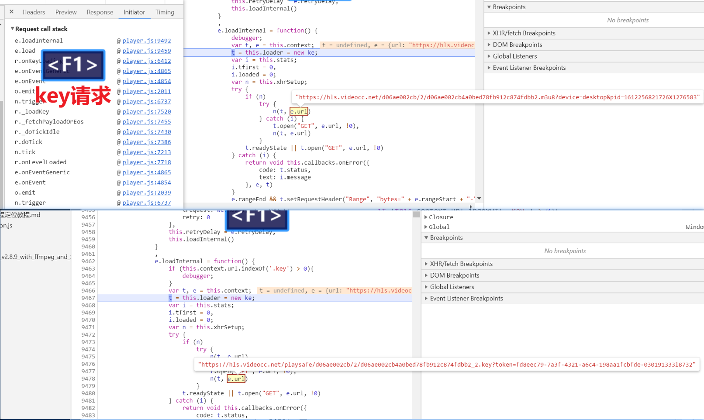

接着就跟着走...


然后你就发现走了半天，走到了`readystatechange`，而这个方法正好在`loadInternal`下面

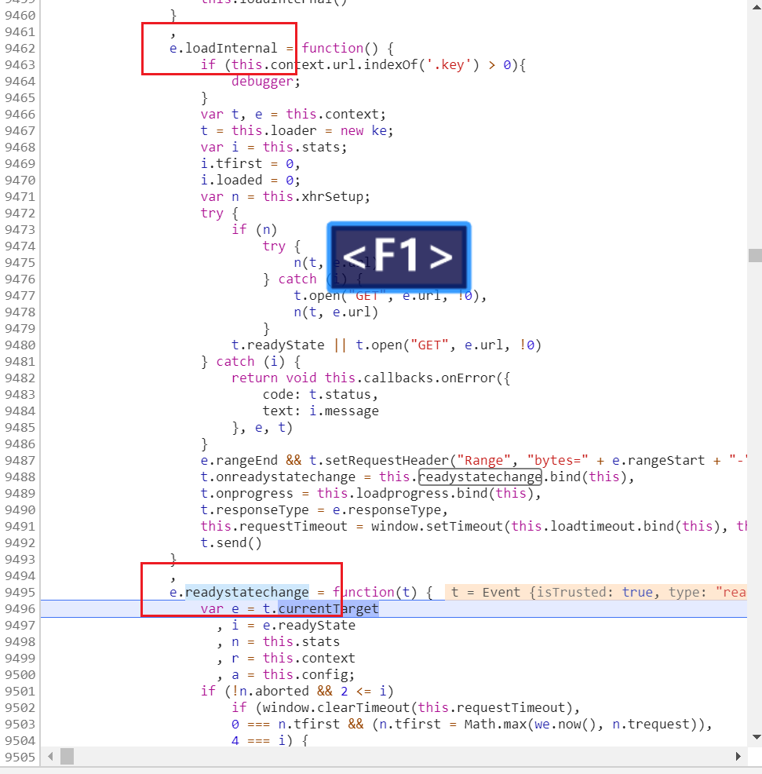

这个时候呢，稍微细心一点，你就能发现这里有一点似曾相识

这里有一个名为`callbacks.onSuccess`的函数，而且有`response`之类的名字

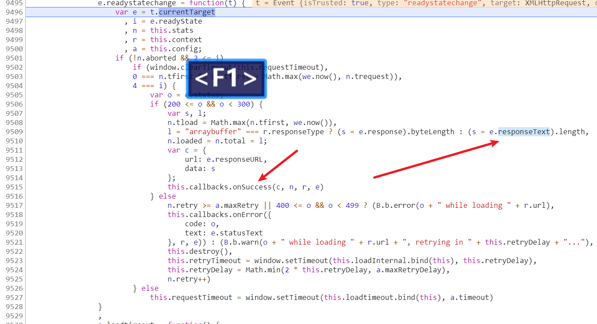

那么很可能就是在这里，拿到返回结果，进行了处理

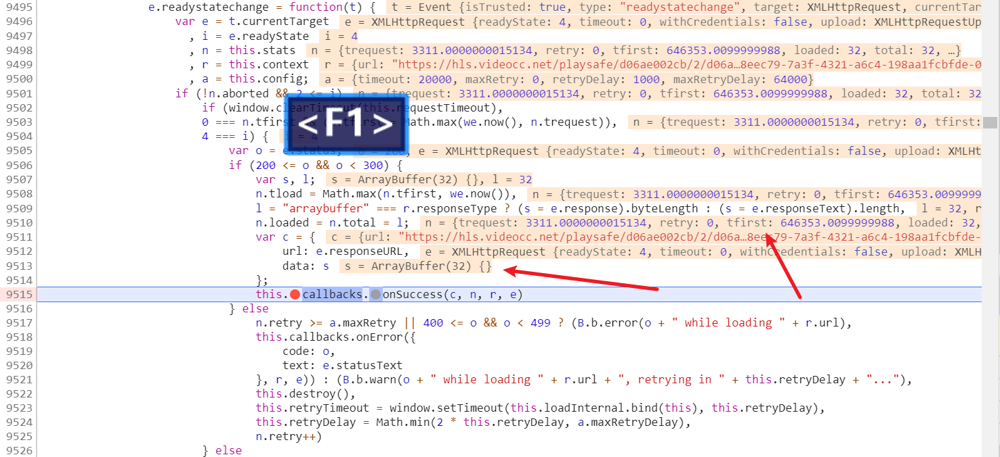

一步一步走，可以确认这里确实是`key`请求的返回，那么接着进入`callbacks.onSuccess`

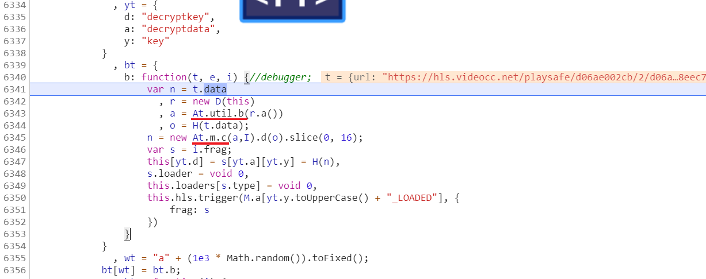

这下是不是就更加眼熟了，没错就是之前分析的内容加解密过程用到的函数，而`t.data`正是加密`key`

方案二：根据`XMLHttpRequest`特点快速定位

搜索`XMLHttpRequest` + `loadInternal`，会发现官方文档没有什么信息，但是能找到一些和hls相关的

不过这也很正常，毕竟这里是在播放视频，那么可以推测这里js的请求相当于是继承自`XMLHttpRequest`

那么它们应该有一些相似之处

这个时候，站在开发者角度，在请求完key之后，肯定需要去处理它，那么我们可以搜索`XMLHttpRequest` + `回调`找一些例子

比如mozilla的说明

- https://developer.mozilla.org/zh-CN/docs/Web/API/XMLHttpRequest/Synchronous_and_Asynchronous_Requests
- https://developer.mozilla.org/zh-CN/docs/Web/API/XMLHttpRequest/onreadystatechange

也就是说赋值给`onreadystatechange`的就是回调函数

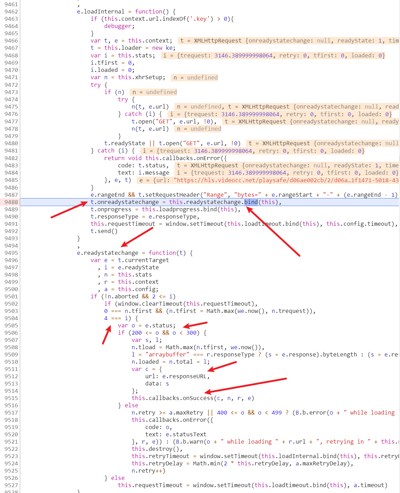

至于这里怎么绑定的，具体原理就不展开了（我也不会），那么这样一下就能定位到请求成功后的处理函数了

再往后就和上面一样了

这里再扩展一下，搜一下`onSuccess`，然后下断点，就能找到每种请求分别绑定什么函数了

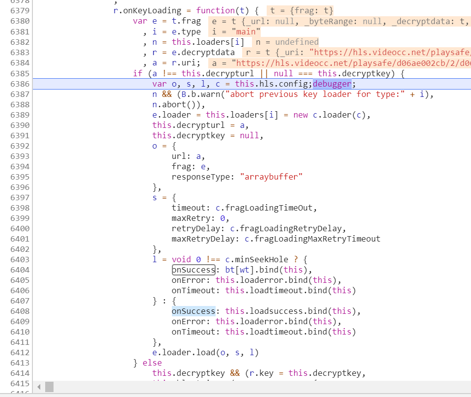

这样，后面再遇到类似的情况，就可以迅速找到需要的关键函数

## 异常定位法

比如我们在返回结果是key的时候，把它变成另外一个值，这里直接在js源码中修改的

尝试去掉token重定向到本地似乎不行，似乎有跨域限制，当然还有其他替换key内容的手段，抓包软件、重定向什么的

这里是把它从32位改成33位0，结果直接在解密的地方抛出异常了~~~

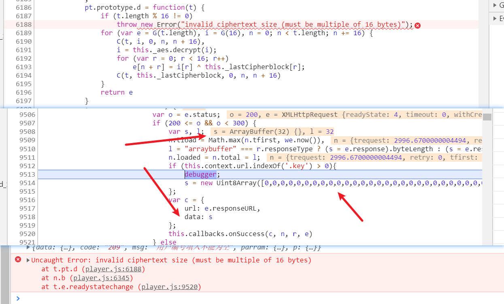

然后我们在出现异常的位置前面下断点，然后等它停在那里，然后再往上看一下调用栈，是不是就是解密过程了

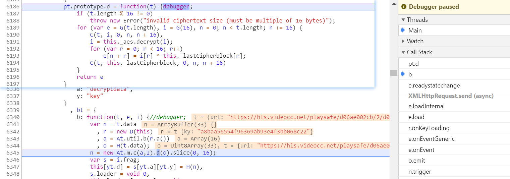

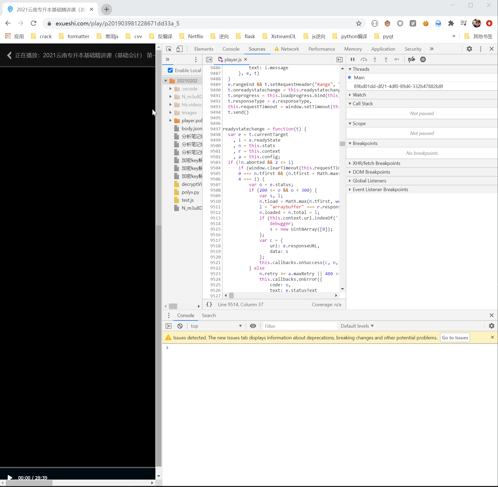

## 解密过程代码分析

首先是函数`D`，进入后发现`this.h`就是字符`h`，而`o()`实际上是之前的`md5`函数

简言之，这里就是取一个变量`minSeekHole`的值，乘以2，转字符串，求md5

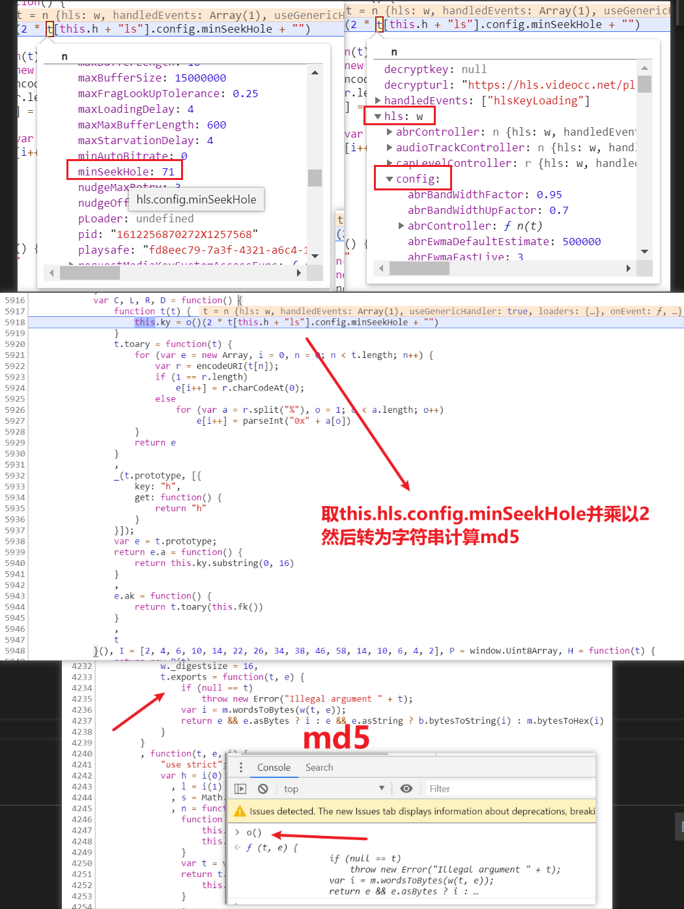

然后是取md5结果的前16位转为一个数组

接着把key用函数`H`进行了转，跳入可以看到就是转成了一个`Uint8Array`数组

而下一步解密用的IV变量`I`实际上是一个固定数组

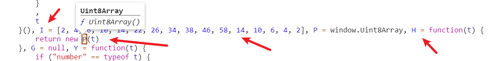

最终解密结果放到了`this.decryptkey`和`*.frag.decryptdata.key`中

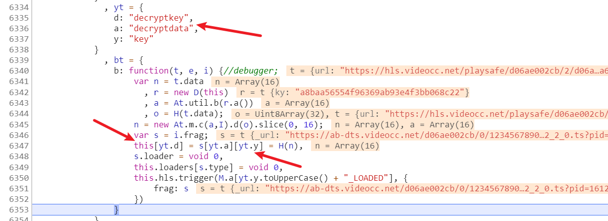

但是，但是这里并没有完，如果记忆力足够好，应该能记得之前`At.m.c`是三个参数

最后一个参数传了一个`!0`也就是`true`，显然这肯定不太一样

如果觉得一样可以手动验证一下之前的aes代码解密对比一下结果，就可以发现不一样

那么进入这个函数进行分析

进来就发现是一个if判断，这里要提一点

`if (A, B, C){xxx}`这种形式的判断，实际上判断的是最后一个条件`C`，但是前面的`A`和`B`的代码实际上也会执行，具体参见下面的例子

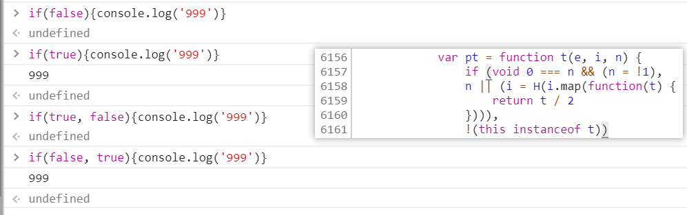

演示代码

```javascript
if(false){console.log('999')}
if(true){console.log('999')}
if(true, false){console.log('999')}
if(console.log('+++'), true){console.log('999')}
```

不过这里最后一个条件时`this instanceof t`肯定为真，因为这个函数最开始是`new xxx`来的，然后取反就是`false`，也就是说一定不会`throw Error`

但是前面部分是要计算的，现在来分析这一句话

```javascript
void 0 === n && (n = !1), n || (i = H(i.map(function(t) {return t / 2}))), !(this instanceof t)
```

第三个参数`n`为`true`，那么

- `void 0 === n` 结果是 `false`
- 不会进行 `n = !1` 这一步赋值
- `n`第一个`,`之后还是`true`，那么`||`之后的部分就不会执行

第三个参数`n`为`undefined`，那么

- `void 0 === n` 结果是 `true`
- 会进行 `n = !1` 这一步赋值 `n` 变成 `false`
- `n`第一个`,`变成`false`，那么`||`之后的部分就会执行
- `i`的值就会分别除以2

然后如果`i`传入的不是`16`位，那它就会被置为16位全0，也就是没有偏移量

按正常逻辑，我们可能推测`_lastCipherblock`还有对`i`的处理，但是由于之前验证`iv`过是没有变化时，是标准的aes

现在把截止这里对`iv`的处理，加入代码，然后验证，可以发现`加密key解密结果`与浏览器一致

也就是没有更多的处理（实际上某些网站`_lastCipherblock`这里还会继续处理，只是这里没有罢了，就不分析了）

那么最终key解密过程还原为下面的代码

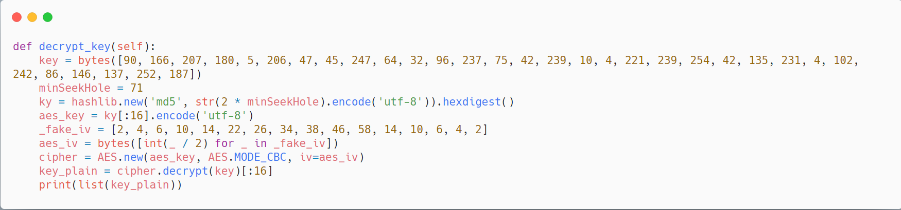

# 小结

完成key的解密后，最终就能写出一个完整的解析脚本，只需要网页地址和视频VID